# Hypergame Models for Cyber Defense in a Purple Team Setting Appendix

This repository is the appendix for the paper titled "Hypergame Models for Cyber Defense in a Purple Team Setting" by Whitney et al. 

## Figure A1

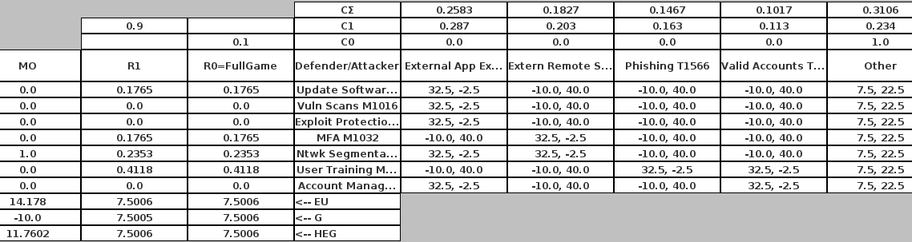

Figure A1 shows the Hypergame Normal Form (HNF) results for the initial exploitation hypergame. 

## Figure A2

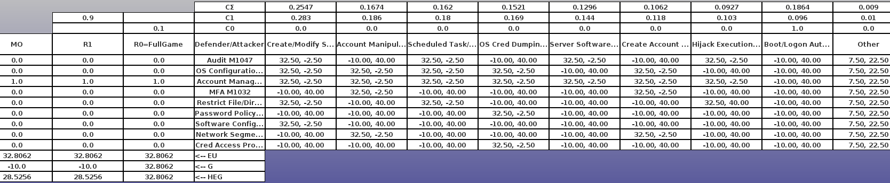

Figure A2 shows the HNF results for the persistence hypergame.

## Figure A3

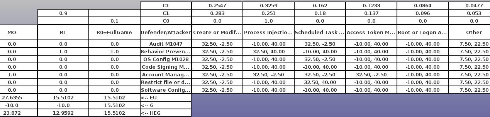

Figure A3 shows the HNF results for the privilege escalation hypergame.

## Figure A4

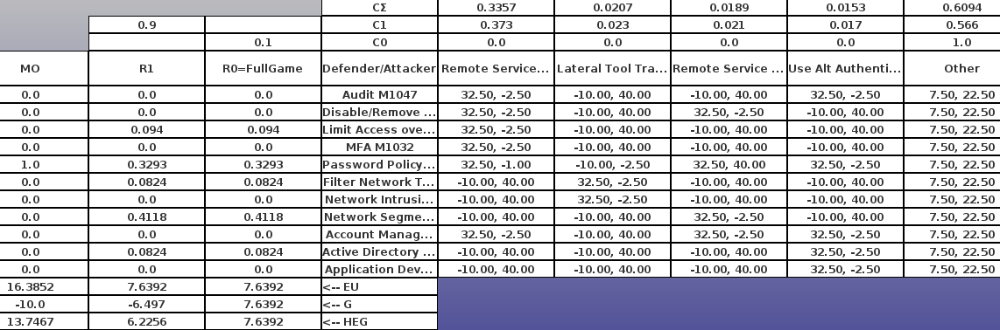

Figure A4 shows the HNF results for the lateral movement hypergame.

## Figure A5

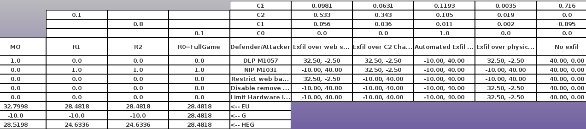

Figure A5 shows the HNF results for the exfiltration hypergame.

## Figure A6

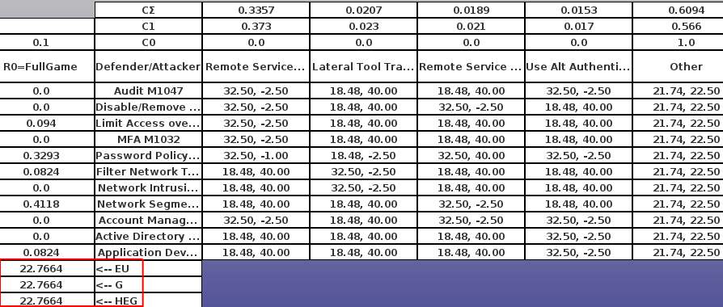

Figure A6 shows the HNF results for lateral movement with EU(E) substitution, where E means the exfiltration hypergame from Figure A5. 

## Figure A7

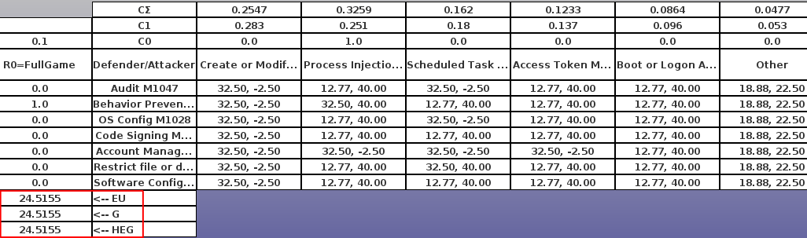

Figure A7 shows the HNF results for privilege escalation with EU(LM) substitution, where LM means lateral movement hypergame from Figure A6.

## Figure A8

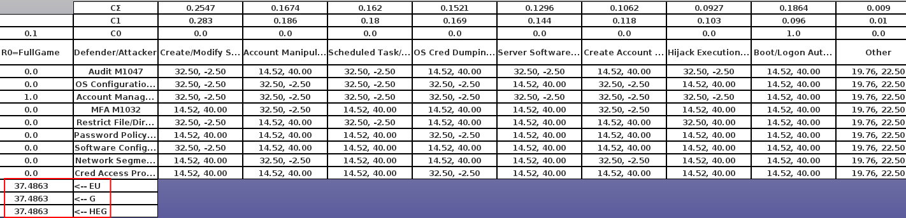

Figure A8 shows the HNF results for persistence with EU(PE) substitution, where PE means privilege escalation hypergame from Figure A7. 

## Figure A9

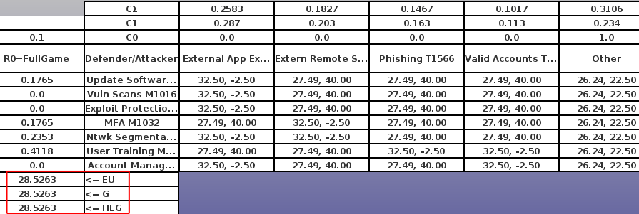

Figure A9 shows the HNF results for initial exploitation with EU(P) substition, where P means persistence hypergame from Figure A8. 

## Figure A10

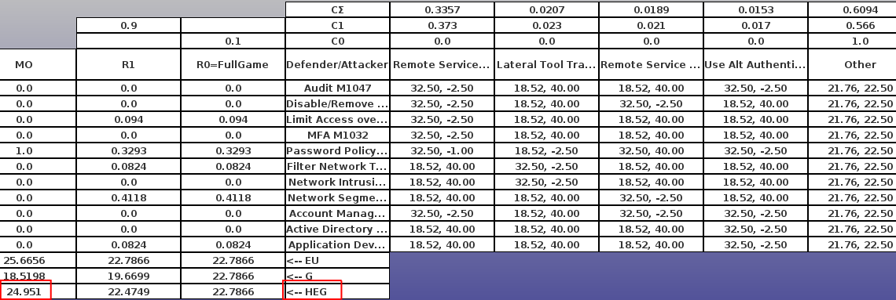

Figure A10 shows the HNF results for lateral movement with HEU(E) substitution, where E means exfiltration hypergame from Figure A5.

## Figure A11

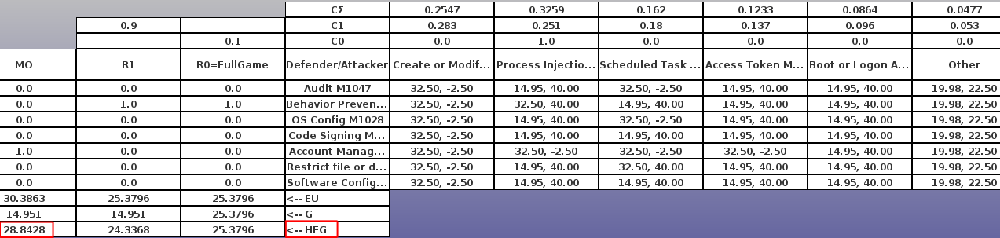

Figure A11 shows the HNF results for privilege escalation with HEU(LM) substitution, where LM means lateral movement hypergame from Figure A10.

## Figure A12

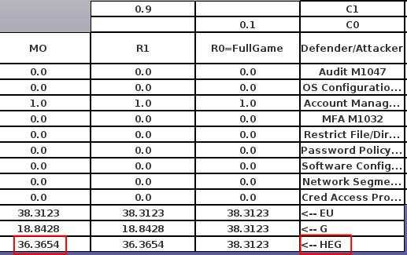

Figure A12 shows the HNF results for persistence with HEU(PE) substitution, where PE means privilege escalation hypergame from Figure A10.

## Figure A13

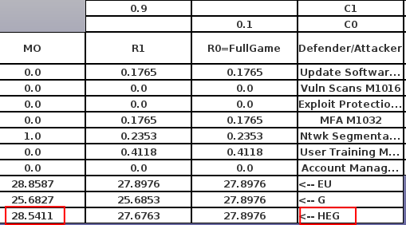

Figure A13 shows the HNF results for initial exploitation with HEU(P) substitution, where P means persistence hypergame from Figure A12.

## Figure A14

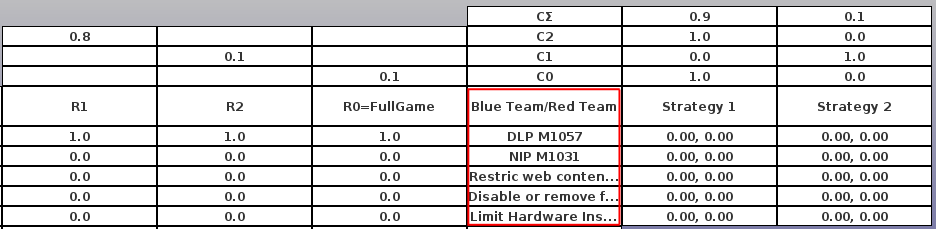

Figure A14 shows an HNF example filled in with information from the *hypergame analysis* step. The red boxes indicate the portion of the HNF to be filled in during this step. 

## Figure A15

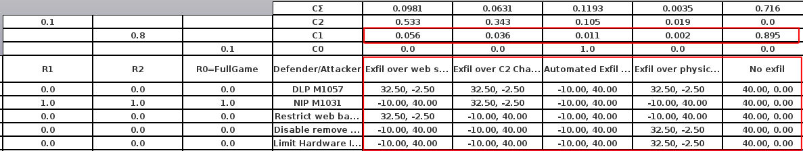

Figure A15 shows an HNF example filled in with information from the *adversary profiling via hypergame* step. The red boxes indicate the portion of the HNF to be filled in during this step. 

## Figure A16

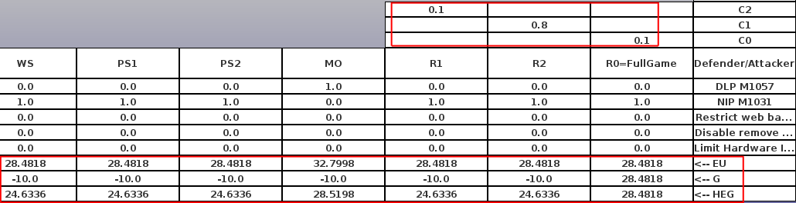

Figure A16 shows an HNF example filled in with information from the *discuss hypergame results* step. The red boxes indicate the portion of the HNF to be filled in during this step.

## Figure A17

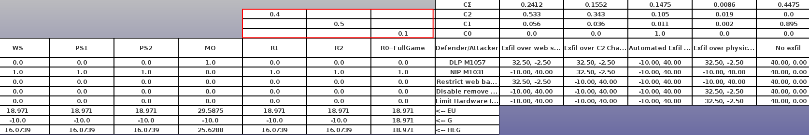

Figure A17 shows an HNF example filled in with information from the *update hypergame information* step. The red boxes indicate a portion of the HNF that can be updated during this step. Contrast with Figure A17.